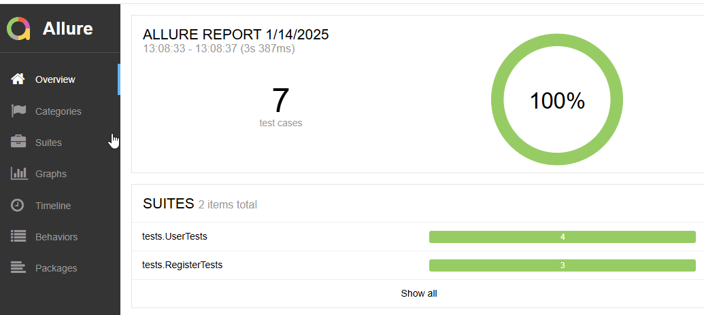
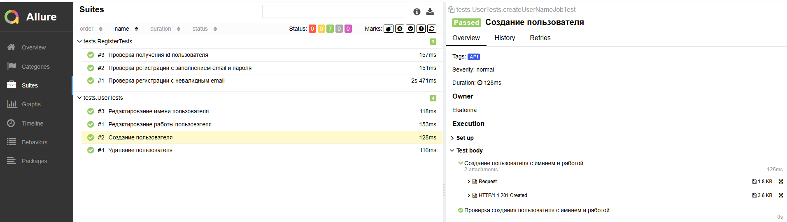
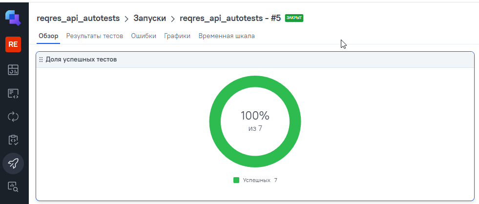
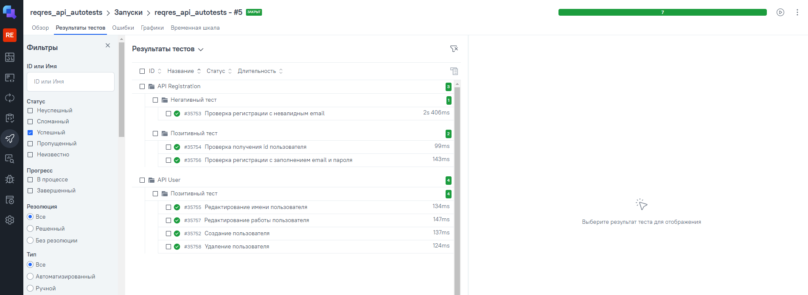
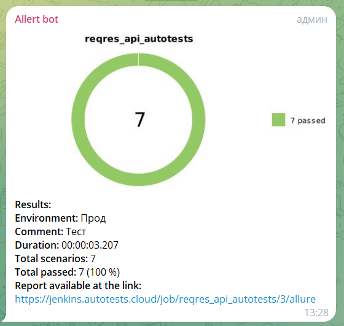

# Проект автоматизации тестирования (API) для сайта reqres.in


## Содержание
* <a href="#tools">Технологии и инструменты</a>
* <a href="#tests">Тест-кейсы</a>
* <a href="#autotest">Запуск автотестов</a>
* <a href="#jenkins">Сборка Jenkins</a>
* <a href="#joinjenkins">Интеграция с Allure report</a>
* <a href="#allure">Отчет в Allure</a>
* <a href="#testops">Интеграция с Allure TestOps</a>
* <a href="#telegramBot">Уведомления в Telegram bot</a>

---

<a id="tools"></a>
## <a name="Технологии и инструменты">**Технологии и инструменты**</a>

<p align="center">
<a href="https://www.java.com/"> </a>
<a href="https://www.jetbrains.com/"> </a>                                   
<a href="https://gradle.org/"> </a>                                     
<a href="https://junit.org/junit5/"> </a>    
<a href="https://github.com/"> </a>   
<a href="https://www.jenkins.io/"> </a>


- Используемый стек:
    - <code>Java</code> - автотесты написаны на Java
    - <code>Gradle</code> - инструмент автоматизации сборки
    - <code>JUnit 5</code> - фреймворк для выполнения автотестов
    - <code>Rest Assured</code> - фреймворк для тестирования REST-API

- Используемая инфраструктура:
    - <code>Github</code> - хранение кода
    - <code>Jenkins</code> - CI/CD для запуска тестов удаленно
    - <code>Allure</code> - визуализация результатов тестирования
    - <code>Telegram Bot</code> - инструмент для отправки результатов тестирования

- Интеграции:
    - <code>Allure TestOps</code> - тест менеджмент система
 
---

<a id="tests"></a>
## <a name="Тест-кейсы">**Тест-кейсы**</a>

API:

7 тестов проверяют функционал [сайта](https://reqres.in/)

 - регистрацию пользователя с валидным email и паролем
 - регистрацию пользователя с невалидным email
 - проверку получения id пользователя
 - создание пользователя
 - редактирование имени пользователя
 - редактирование работы пользователя
 - удаление пользователя

 ---

 <a id="autotest"></a>
## <a name="Запуск автотестов" style="color:black">**Запуск автотестов**</a>

### Запуск тестов из терминала

```
./gradlew clean test
```

---

<a id="jenkins"></a>
## <a name="Сборка Jenkins:" style="color:black">**Сборка Jenkins:**</a>

Тесты запускаются через [Jenkins](https://jenkins.autotests.cloud/job/reqres_api_autotests/)  
Для запуска тестов необходимо нажать на кнопку "Build". Появится прогресс бар с номером сборки тестов. 


---

<a id="joinjenkins"></a>
## <a name="Интеграция с Allure report:">**Интеграция с Allure report:**</a>

После прохождения тестов, появляется диаграмма прохождения, по которой, в цветовом значении, наглядно видно количество успешных и неуспешных тестов



<a id="allure"></a>
## <a name="Отчет в Allure">**Отчет в Allure**</a>

 При нажатии на тестовый набор, раскрывается названия всех тестов. При нажатии на определенный тест, раскрываются шаги теста с приложенными вложениями
[Allure](https://jenkins.autotests.cloud/job/reqres_api_autotests/5/allure/#suites/19862570f633e792c46dce0454413824/50e99da402c25413/)



---

<a id="testops"></a>
## <a name="Интеграция с Allure TestOps">**Интеграция с Allure TestOps**</a>

В [TestOps](https://allure.autotests.cloud/launch/43776) можно посмотреть диаграмму прохождения тестов



Так же можно посмотреть более подробную информация по тестам



---

<a id="telegramBot"></a>
## <a name="Уведомления в Telegram bot">**Уведомления в Telegram bot**</a>

Для быстрой визуализации отчетности, после выполнения тестов, результат отчета дублируется в Telegram бот:
<p align="center">
    
</p>
